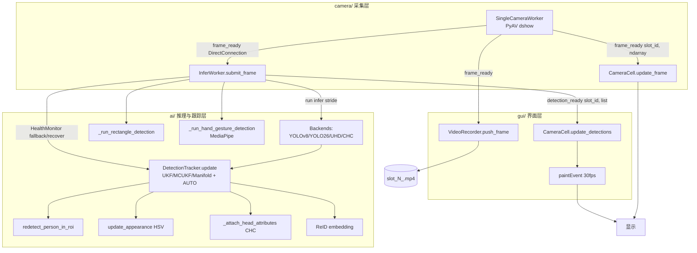

# VisionBata（VisionDataPlatform）项目架构总结

> 总结日期：2026-07-14
> 范围：`F:\VisionBata` 全量（只读检查，未修改任何源代码）
> 项目版本：1.1.1（`main.py` 中 `setApplicationVersion("1.1.1")`）
> 检查模式：只读（基于 `ai/`、`camera/`、`gui/`、`main.py` 实际源码逐文件核对）
> 归档位置：本文与历史版本同存于 `architecture/` 目录

---

## 一、项目概览

VisionBata 是一个基于 **PyQt6** 的桌面端视觉检测平台，核心目标：实时多路摄像头采集 → 推理得到检测/姿态/属性 → 跟踪平滑 → 叠加绘制显示，并支持 H.264 录像。

集成能力（截至本总结）：
- **多摄像头采集**：PyAV / DirectShow，最多 4 路。
- **目标检测**：YOLOv8（ONNX Runtime / DirectML）、YOLO26（Detect / OBB，ultralytics）、PINTO0309 **UHD** 轻量人体检测（ONNX 含后处理）、**CHC** 头部属性分类（Hat/Mask/Sunglass/Eye/Mouth）。
- **跟踪**：纯 NumPy 实现的无迹卡尔曼滤波 **UKF / MCUKF / ManifoldUKF** + **AUTO** 自适应切换；匈牙利 / 级联（ByteTrack 两阶段）匹配；HSV 外观 + ReID 嵌入；ROI 重检测；HealthMonitor 异常自动回退。
- **姿态 / 手势**：身体 17 关键点几何手势（已禁用）、MediaPipe 手部手势（已禁用）。
- **自定义绘制 GUI**：冷蓝灰暗色 Fusion 主题，2×2 摄像头网格。

架构采用**单一共享推理线程 `InferWorker` 服务全部 4 路画面槽位 + 每路独立采集线程**的设计，通过 Qt 信号槽串联「采集 → 推理 → 跟踪 → GUI 绘制 → 录像」。

---

## 二、目录与模块结构

```
F:\VisionBata
├── main.py                      # 应用入口：异常钩子 + 高DPI + 启动引导
├── start.bat                    # Windows 启动脚本（硬编码绝对路径调用 venv python）
├── requirements.txt             # 第三方依赖清单
├── error.log                    # 运行错误日志（约 17MB）
├── models/                      # 模型文件 .pt/.onnx（运行时依赖，不属源码）
│   ├── yolov8n.pt / .onnx / yolov8n-pose.pt / .onnx
│   ├── yolo26n.pt / yolo26n-obb.pt / yolo26s.pt
│   ├── uhd_n_64x64_static.onnx  # PINTO0309 UHD 人体检测
│   ├── chc_s_wo_fiqa.onnx       # 头部属性分类
│   └── test_obb.jpg
├── ai/                          # 推理 / 跟踪 / 识别核心
├── camera/                      # 采集 / 录像
├── gui/                         # PyQt6 界面层
├── docs/                        # 专题设计文档（5 份：去噪/自适应滤波/MCUKF/PINTO0309 等）
├── tests/                       # 单元测试（test_obb_stage2.py）
├── recordings/                  # 录像输出 slot_N_*.mp4
├── venv/                        # Python 3.11 虚拟环境
└── architecture/                # 本项目架构文档归档目录（本总结所在位置）
```

### 2.1 ai/ 推理与识别层（13 个源文件）

### ai/__init__.py
- 路径：`ai/__init__.py`
- 功能：包导出，仅对外暴露 `InferWorker`。
- 主要组件：模块级 `from ai.inference import InferWorker`
- 内部依赖：`ai/inference.py`

### ai/model_task.py
- 路径：`ai/model_task.py`
- 功能：定义 `ModelTask` 枚举（DETECT/POSE/OBB），取代字符串硬编码以统一路由推理与后处理逻辑。
- 主要组件：`class ModelTask(Enum)`（DETECT / POSE / OBB）
- 内部依赖：无（零依赖叶子模块）

### ai/detection.py
- 路径：`ai/detection.py`
- 功能：统一检测结果数据模型与几何工具；定义 `Detection`/`Keypoint` dataclass，并提供多边形 IoU、外接框转换等纯函数，向后兼容旧 dict schema。
- 主要组件：`Detection`、`Keypoint`、`polygon_iou()`、`polygon_center()`、`polygon_to_bbox()`、`_fallback_bbox_iou()`、`_shapely_iou()`
- 内部依赖：第三方 `numpy`；可选 `shapely`

### ai/onnx_yolo_backend.py
- 路径：`ai/onnx_yolo_backend.py`
- 功能：YOLO ONNX 推理后端，基于 ONNX Runtime / DirectML 加速，输出统一 `Detection` 列表。
- 主要组件：`class OnnxYoloBackend`
- 内部依赖：`ai/detection.py`、`ai/model_task.py`

### ai/yolo26_backend.py
- 路径：`ai/yolo26_backend.py`
- 功能：YOLO26（Detect / OBB）推理后端，基于 ultralytics 加载 `.pt`，支持 OBB 多边形输出。
- 主要组件：`class Yolo26Backend`
- 内部依赖：`ai/detection.py`、`ai/model_task.py`；第三方 `ultralytics`

### ai/uhd_backend.py
- 路径：`ai/uhd_backend.py`
- 功能：PINTO0309 UHD 轻量人体检测后端（64×64 ONNX，含后处理），与 OnnxYolo 并行用于 CPU 人体检测。
- 主要组件：`class UhdBackend`
- 内部依赖：`ai/detection.py`；第三方 `onnxruntime`

### ai/head_classifier.py
- 路径：`ai/head_classifier.py`
- 功能：CHC 头部属性分类后端（Hat/Mask/Sunglass/Eye/Mouth），作为 person 检测后的属性增强模块。
- 主要组件：`class HeadClassificationBackend`
- 内部依赖：`ai/detection.py`；第三方 `onnxruntime`

### ai/reid_backend.py
- 路径：`ai/reid_backend.py`
- 功能：ReID 重识别嵌入后端（当前为确定性哈希 256 维 mock，预留 ONNX 加载），供跟踪匹配时关联同一目标。
- 主要组件：`class ReIDBackend`
- 内部依赖：`ai/detection.py`

### ai/rectangle_detector.py
- 路径：`ai/rectangle_detector.py`
- 功能：矩形检测（Canny/轮廓）与 `RectangleTracker`（线性卡尔曼 8 维）跟踪，用于特定颜色/形状目标。
- 主要组件：`RectangleDetector`、`RectangleTracker`、`_RectangleTrack`、`_RectangleKalman`
- 内部依赖：第三方 `numpy`（独立模块，不依赖其他 ai 子模块）

### ai/gesture_recognizer.py
- 路径：`ai/gesture_recognizer.py`
- 功能：身体姿态手势识别（基于 17 COCO 关键点几何），当前默认禁用。
- 主要组件：`class GestureRecognizer`
- 内部依赖：`ai/detection.py`

### ai/hand_gesture_recognizer.py
- 路径：`ai/hand_gesture_recognizer.py`
- 功能：手部手势识别（基于 MediaPipe Hands 关键点），当前默认禁用。
- 主要组件：`class HandGestureRecognizer`
- 内部依赖：`ai/detection.py`；第三方 `mediapipe`

### ai/tracker.py
- 路径：`ai/tracker.py`
- 功能：核心跟踪器 `DetectionTracker`，纯 NumPy 实现 UKF/MCUKF/ManifoldUKF 三种滤波器 + `_FilterAdaptor` 自适应切换；支持 greedy/匈牙利/级联三种匹配策略、HSV 外观、ROI 重检测、ReID 嵌入。
- 主要组件：`DetectionTracker`、`_DetectionUKF`、`_DetectionMCUKF(_DetectionUKF)`、`_DetectionManifoldUKF(_DetectionUKF)`、`_FilterAdaptor`、`_Track`
- 内部依赖：`ai/detection.py`

### ai/inference.py
- 路径：`ai/inference.py`
- 功能：★核心引擎 `InferWorker(QThread)`——服务全部 4 路槽位的共享推理线程；聚合所有检测后端、跟踪、去噪、ROI 重检测、头部属性、ReID、HealthMonitor 恢复，并管理双缓冲帧槽 `_FrameSlot`。
- 主要组件：`InferWorker(QThread)`、`_HealthMonitor`、`SuperResEngine`、`_FrameSlot`
- 内部依赖：`ai/onnx_yolo_backend.py`、`ai/yolo26_backend.py`、`ai/uhd_backend.py`、`ai/head_classifier.py`、`ai/tracker.py`、`ai/detection.py`、`ai/model_task.py`、`ai/rectangle_detector.py`、`ai/reid_backend.py`、`camera`（类型引用）

### 2.2 camera/ 采集与录像层（4 个源文件）

### camera/__init__.py
- 路径：`camera/__init__.py`
- 功能：包导出，集中暴露采集/枚举/录像组件。
- 主要组件：`from camera.enumerator import CameraInfo, scan_cameras`；`from camera.capture import SingleCameraWorker, CameraCapture`；`from camera.recorder import VideoRecorder`
- 内部依赖：`camera/enumerator.py`、`camera/capture.py`、`camera/recorder.py`

### camera/enumerator.py
- 路径：`camera/enumerator.py`
- 功能：三级摄像头枚举，产出 `CameraInfo` 列表供 UI 选择。
- 主要组件：`class CameraInfo`、`scan_cameras()`
- 内部依赖：第三方 `cv2`/`pyav`（无本项目内部依赖）

### camera/capture.py
- 路径：`camera/capture.py`
- 功能：`SingleCameraWorker(QThread)`（PyAV dshow 拉流）+ `CameraCapture` 管理器，逐帧产出 `ndarray` 并通过信号上报。
- 主要组件：`class SingleCameraWorker(QThread)`、`class CameraCapture`
- 内部依赖：`camera/enumerator.py`

### camera/recorder.py
- 路径：`camera/recorder.py`
- 功能：`VideoRecorder`（PyAV 写 MP4，H.264）+ 守护线程池，将推理后帧异步落盘。
- 主要组件：`class VideoRecorder`、`class _RecorderThread(threading.Thread)`
- 内部依赖：第三方 `av`（PyAV）（无本项目内部依赖）

### 2.3 gui/ 界面层（8 个源文件）

### gui/__init__.py
- 路径：`gui/__init__.py`
- 功能：空包初始化文件（无导出）。
- 主要组件：无
- 内部依赖：无

### gui/theme.py
- 路径：`gui/theme.py`
- 功能：冷蓝灰暗色 Fusion 主题常量与 QSS 样式表，全局复用。
- 主要组件：主题常量、`get_stylesheet()` 等
- 内部依赖：第三方 `PyQt6`（无本项目内部依赖）

### gui/animations.py
- 路径：`gui/animations.py`
- 功能：Qt 属性动画辅助（缓动曲线、悬停、呼吸、淡入、骨架展示控件）。
- 主要组件：`Easing`、`AnimationHelper`、`HoverAnimation`、`SkeletonWidget(QWidget)`
- 内部依赖：第三方 `PyQt6`（无本项目内部依赖）

### gui/safe_widgets.py
- 路径：`gui/safe_widgets.py`
- 功能：防滚轮抢焦点的组合/数值控件（避免滚动误改配置）。
- 主要组件：`_WheelFocusMixin`、`WheelFocusComboBox`、`WheelFocusSpinBox`、`WheelFocusDoubleSpinBox`
- 内部依赖：第三方 `PyQt6`（无本项目内部依赖）

### gui/splash_screen.py
- 路径：`gui/splash_screen.py`
- 功能：启动闪屏 `SplashScreen`，`finished` 信号触发主窗口淡入。
- 主要组件：`class SplashScreen(QWidget)`
- 内部依赖：`gui/theme.py`；第三方 `PyQt6`

### gui/camera_cell.py
- 路径：`gui/camera_cell.py`
- 功能：★单路画面 `CameraCell(QWidget)`——接收 `frame_ready`/`detection_ready`，绘制视频帧、检测框、关键点、跟踪标签、属性与预测/重检虚线框。
- 主要组件：`class CameraCell(QWidget)`
- 内部依赖：`ai/detection.py`、`gui/theme.py`

### gui/settings_dialog.py
- 路径：`gui/settings_dialog.py`
- 功能：`SettingsDialog(QDialog)`——所有 AI/录像配置项的可视化编辑与 `QSettings` 持久化，涵盖模型路径、置信度、滤波类型、去噪、匹配策略、ROI 重检测、ReID、头部属性、矩形检测等。
- 主要组件：`class SettingsDialog(QDialog)`
- 内部依赖：`gui/theme.py`；读取 `ai/*` 配置默认值（运行期引用）；第三方 `PyQt6`

### gui/main_window.py
- 路径：`gui/main_window.py`
- 功能：★主窗口 `MainWindow(QMainWindow)`——构建 2×2 摄像头网格、信号槽调度（采集↔推理↔绘制↔录像）、配置下发、启停控制。
- 主要组件：`class MainWindow(QMainWindow)`
- 内部依赖：`gui/camera_cell.py`、`gui/settings_dialog.py`、`gui/splash_screen.py`、`gui/animations.py`、`ai/inference.py`、`camera/*`

### 2.4 根入口与测试

### main.py
- 路径：`main.py`
- 功能：应用入口——`setup_global_exception_hook()` 写 `error.log`；`configure_high_dpi()` + `create_application()` 建 QApplication（Fusion 风格、Segoe UI 字体）；`main()` 加载 `SplashScreen` 与 `MainWindow`，闪屏结束淡入主窗，最后 `app.exec()`。
- 主要组件：`setup_global_exception_hook()`、`configure_high_dpi()`、`create_application(argv)`、`main()`
- 内部依赖：`gui/main_window.py`、`gui/splash_screen.py`

### tests/test_obb_stage2.py
- 路径：`tests/test_obb_stage2.py`
- 功能：OBB 第二阶段（多边形关联）单元测试，验证 `DetectionTracker` 的 OBB 跟踪回归。
- 主要组件：pytest 风格测试函数
- 内部依赖：`ai/detection.py`、`ai/tracker.py`

---

## 三、启动流程

1. `setup_global_exception_hook()`：安装 `sys.excepthook`，未捕获异常写入 `error.log`（含类型/值/完整 traceback）。
2. `create_application(argv)`：开启高 DPI 缩放（`QT_ENABLE_HIGHDPI_SCALING`）、设置 Segoe UI 字体、`setStyle("Fusion")`。
3. `main()` 中 `app.setApplicationName("VisionDataPlatform")` / `Version("1.1.1")` / `OrganizationName("VisionBata")`。
4. 延迟导入 `gui.main_window.MainWindow` 与 `gui.splash_screen.SplashScreen`：
   - 创建 `SplashScreen()` 与 `MainWindow()`（`setWindowOpacity(0.0)` 初始透明）；
   - `splash.finished.connect(show_main_window)`，`splash.start()`；
   - 闪屏结束 → `main_window.show()` + 320ms `OutCubic` 淡入动画。
5. `return app.exec()` 进入事件循环。

> 关闭顺序（代码约定）：录像 → 摄像头 → 推理线程（等待约 3s）→ blockSignals 收尾。

---

## 四、端到端数据流



关键信号/槽（均定义在 `MainWindow.__init__` 中连接）：
- `worker.frame_ready(slot_id, frame)` → `cell.update_frame`（QueuedConnection 显示）+ `infer_worker.submit_frame`（DirectConnection 推理）+ `_on_frame_for_recording`（录像）。
- `infer_worker.detection_ready(slot_id, detections)` → `cell.update_detections`（QueuedConnection）。
- 关闭时 `try/except TypeError` 安全 disconnect。

---

## 五、模块依赖关系（无循环）

- 最底层核心（零/少依赖）：`ai/model_task.py`、`ai/detection.py`（被 8+ 处引用）。
- 中层后端：`ai/onnx_yolo_backend.py`、`ai/yolo26_backend.py`、`ai/uhd_backend.py`、`ai/head_classifier.py`、`ai/reid_backend.py` → 依赖 `detection` + `model_task`；`ai/rectangle_detector.py` 独立（仅 numpy）。
- 跟踪：`ai/tracker.py` → `detection`。
- 上层聚合：`ai/inference.py` → 聚合全部 `ai` 子模块（10 个内部依赖）。
- 采集：`camera/capture.py` → `camera/enumerator.py`；`camera/__init__.py` 反向导出三者（命名误导但无环）。
- 界面：`gui/main_window.py` → 聚合 `ai.inference` + `camera` 三模块 + `gui` 六模块（9 个内部依赖）。
- 入口：`main.py` → `gui.main_window` + `gui.splash_screen`。

> 经验证无循环依赖（2026-07-12 曾做依赖图验证）。

---

## 六、技术栈

| 类别 | 选型 | 说明 |
|------|------|------|
| GUI | PyQt6 ≥ 6.2.0 | QApplication / QThread / QSettings / Fusion 风格 |
| 推理（PyTorch） | ultralytics ≥ 8.0.0 | YOLOv8 / YOLO26 `.pt`，CPU 推理 |
| 推理（ONNX） | onnxruntime ≥ 1.22.0 + onnxruntime-directml | DirectML 加速（GPU），UHD/CHC `.onnx` |
| 视频采集 | av（PyAV） ≥ 10.0.0 | `directShow` dshow 拉流 |
| 图像 | opencv-python ≥ 4.5.0 | 矩形检测 Canny/轮廓、色彩空间 |
| 数值 | numpy ≥ 1.21.0 | 纯 NumPy 实现 UKF/MCUKF/ManifoldUKF |
| 手部 | mediapipe ≥ 0.10.0 | HandGestureRecognizer（默认禁用） |
| 几何 | shapely（可选） | 多边形 IoU 精确计算，缺失时退回 bbox IoU |
| 运行环境 | Python 3.11（venv） | 含 numpy/ultralytics/PyQt6/onnxruntime-directml/av/opencv/mediapipe |

---

## 七、QSettings 配置清单

持久化作用域：`org=VisionBata`，`app=VisionDataPlatform`（由 `main.py` 与 `SettingsDialog._SETTINGS_ORG/_SETTINGS_APP` 统一设置）。

| 配置键 | 类型 | 说明 |
|--------|------|------|
| `recording/output_dir` | str | 录像输出目录（默认 `recordings/`） |
| `ai/conf_threshold` | float | 检测置信度阈值 |
| `ai/infer_stride` | int | 跳帧步长（≥2 时非推理帧用卡尔曼填充） |
| `ai/smooth_alpha` | float | 跟踪平滑系数 |
| `ai/hide_delay_ms` | int | 丢失后隐藏延迟（BBOX TTL） |
| `ai/model_path` | str | 当前 AI 检测模型路径 |
| `ai/person_enabled` | bool | 人体检测开关 |
| `ai/skeleton_enabled` | bool | 骨架绘制开关 |
| `ai/gesture_enabled` | bool | 身体手势开关 |
| `ai/gesture_mode` | str | 手势模式 |
| `ai/rectangle_enabled` | bool | 矩形检测开关 |
| `ai/rectangle_sensitivity` | float | 矩形检测灵敏度 |
| `ai/rectangle_max_count` | int | 矩形最大跟踪数（1–10） |
| `ai/rectangle_target_color_rgb` | str | 矩形目标 RGB |
| `ai/rectangle_target_color_hsv` | str | 矩形目标 HSV |
| `ai/rectangle_color_threshold` | float | 矩形颜色阈值（1–100） |
| `ai/person_redetect_max_retries` | int | ROI 重检测尝试次数 |
| `ai/person_redetect_roi_pad` | float | ROI 扩展系数 |
| `ai/filter_type` | str | ukf / mcukf / manifold_ukf / auto |
| `ai/mcukf_kernel_sigma` | float | MCUKF 核带宽 σ |
| `ai/denoise_method` | str | none / bilateral / nl_means |
| `ai/denoise_strength` | int | 去噪强度 1–10 |
| `ai/matching_strategy` | str | greedy / hungarian / cascade |
| `ai/iou_threshold` | float | 匹配 IoU 门控 |
| `ai/max_misses` | int | 最大丢失帧数（遮挡恢复，2→4） |
| `ai/velocity_clip` | float | 速度限幅（UKF/MCUKF/Manifold 全族） |
| `ai/high_conf_thresh` | float | 级联匹配高置信阈值（≥0.5） |
| `ai/redetect_budget` | int | ROI 重检测预算（候选限流） |
| `ai/reid_enabled` | bool | ReID 关联开关 |
| `ai/reid_min_tracks` | int | 触发 ReID 的最小 track 数 |
| `ai/reid_stride` | int | ReID 更新步长 |
| `ai/head_classifier_enabled` | bool | 头部属性开关 |
| `ai/head_classifier_path` | str | CHC 模型路径 |
| `ai/head_classifier_stride` | int | 头部属性跳帧（默认 2） |

---

## 八、已知问题（活跃 / 历史）

`error.log` 历史记录区间约 2026-06-04 ~ 2026-07-09，主要条目经核对多为**已修复或环境相关**，非当前活跃缺陷：

| 条目 | 来源 | 性质 | 当前状态 |
|------|------|------|----------|
| `MediaPipe Hands unavailable: module 'mediapipe' has no attribute 'solutions'` | 手部识别 | 历史 | `hand_gesture_recognizer.py:151` 已加 `try/except` 降级；手势功能默认禁用 |
| `YOLOv8 inference failed: DmlExecutionProvider unavailable` | ONNX DirectML | 环境 | 当前模型识别到 `cpu` 模式自动切 ONNX CPU（`_initialize_backend`）；DirectML 需 GPU 环境 |
| `YOLOv8 inference failed: 'NoneType' object is not iterable` | inference | 历史 | `model.predict()` 返回 None 已加 `except Exception` 保护 |
| `TypeError: 'int' object is not callable` | tracker.py:95 `np.diag(...)` | 历史（已修复） | 2026-07-09 修复为 `np.diag(np.array([...], dtype=np.float64))` |
| `module 'av' has no attribute 'AVError'` | capture.py:45 | 环境 | PyAV ≥ 10 移除 `AVError`，采集端已用 `hasattr` 兼容判断 |
| `FileNotFoundError: yolov8n-pose.pt` | 运行期 | 用户数据 | 模型文件缺失提示，非代码缺陷 |
| `Error stopping... is_alive` / `PyAV error: [Errno 5] I/O error` | 退出 | 边界 | 关闭顺序已约定（录像→摄像头→推理等待3s） |

**当前活跃关注点（建议）**：UHD 在随机噪声上假阳性较多（需结合置信度+tracker 过滤）；InferWorker 单文件约 1792 行偏大（可拆分）；整体单元测试覆盖率低（仅 OBB 第二阶段有测试）。

---

## 九、改进建议

1. **拆分 `ai/inference.py`**：将 `_HealthMonitor`、`SuperResEngine`、各后端编排剥离为独立子模块，降低单文件复杂度、提升可测性。
2. **补充单元测试**：在 `tests/` 增加 UKF/MCUKF/Manifold 数值稳定性、去噪、ReID、ROI 重检测等用例，覆盖已落地的增强模块。
3. **UHD 假阳性治理**：在 `InferWorker` 增加 UHD 置信度+尺寸门控与 tracker 时域一致性过滤。
4. **统一异常提示**：将运行期 `FileNotFoundError` 等引导到 SettingsDialog 显式提示模型缺失。
5. **配置校验**：`load_*` 时增加类型/范围校验，避免异常值进入滤波器导致数值发散。
6. **文档与代码同步**：本目录 `architecture/` 集中归档架构总结，后续重大重构后同步更新本文件。

---

## 十、历史版本归档

本目录同时保留此前两次架构总结，供演进对照：
- `architecture/架构梳理报告-2026-07-08.md`（初版，未含 YOLO26 / PINTO0309 / 自适应滤波）
- `architecture/架构梳理报告-2026-07-09.md`（第二版，较新但仍需与当前代码对齐）

> 本文为第三版（2026-07-14），基于当前真实代码重新核对生成。
