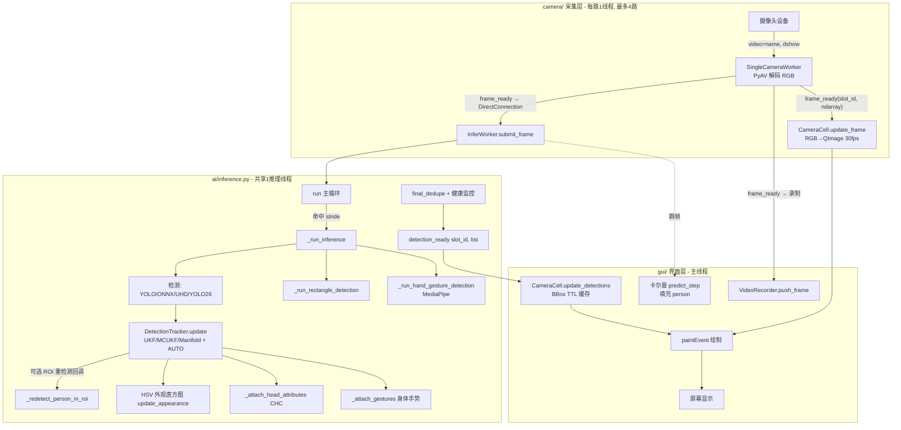

# VisionBata（VisionDataPlatform）项目架构梳理报告

> 分析日期：2026-07-09  
> 分析范围：`F:\VisionBata` 全量（只读检查，未修改任何代码）  
> 项目版本：1.1.1  
> 检查模式：只读（架构梳理 + QQ 邮箱连接验证）

---

## 一、文档说明

本报告基于项目源码逐文件核对生成，用于全面梳理 VisionBata 的架构结构。报告区分了「历史遗留日志错误」与「当前活跃问题」，避免将已修复问题误报为现状。本次检查**未对任何源码文件进行修改**，仅进行阅读、分析与文档整理。

---

## 二、目录结构与模块划分

```
F:\VisionBata
├── main.py                      # 应用入口：全局异常钩子 + 高DPI + 启动引导
├── start.bat                    # Windows 启动脚本（硬编码绝对路径）
├── requirements.txt             # 第三方依赖清单
├── error.log                    # 运行错误日志（约 17MB，2026-06-04 ~ 2026-07-09）
├── 架构梳理报告.md               # 既有架构文档（2026-07-08，已部分过时）
├── debug-yolo-detection-overlay.md  # 模型路径解析 bug 的 debug 记录
├── models/                      # 模型文件（.pt/.onnx 二进制，运行时依赖）
│   ├── yolov8n.pt / yolov8n.onnx / yolov8n-pose.pt / yolov8n-pose.onnx
│   ├── yolo26n.pt / yolo26n-obb.pt / yolo26s.pt
│   ├── uhd_n_64x64_static.onnx  # PINTO0309 UHD 人体检测（ONNX 含后处理）
│   ├── chc_s_wo_fiqa.onnx       # 头部属性分类（Hat/Mask/Sunglass/Eye/Mouth）
│   └── test_obb.jpg
├── ai/                          # 推理 / 跟踪 / 识别核心
│   ├── __init__.py              # 仅导出 InferWorker
│   ├── inference.py             # ★InferWorker 共享推理线程（核心引擎）
│   ├── tracker.py               # DetectionTracker + UKF/MCUKF/ManifoldUKF + AUTO 自适应
│   ├── detection.py             # Detection / Keypoint 统一数据模型
│   ├── model_task.py            # ModelTask 枚举（DETECT/POSE/OBB）
│   ├── onnx_yolo_backend.py     # ONNX Runtime/DirectML YOLO 后端
│   ├── yolo26_backend.py        # YOLO26 .pt 后端（ultralytics）
│   ├── uhd_backend.py           # UHD 64x64 ONNX 人体检测后端
│   ├── head_classifier.py       # CHC 头部属性分类后端
│   ├── rectangle_detector.py    # 矩形检测 + RectangleTracker（线性卡尔曼）
│   ├── gesture_recognizer.py    # 身体姿态手势（17 关键点几何）
│   └── hand_gesture_recognizer.py  # 手部手势（MediaPipe Hands）
├── gui/                         # PyQt6 界面层
│   ├── __init__.py              # 空
│   ├── main_window.py           # ★MainWindow 主窗口 + 信号槽调度
│   ├── camera_cell.py           # ★CameraCell 单路画面 + 叠加绘制
│   ├── settings_dialog.py       # SettingsDialog 配置对话框
│   ├── splash_screen.py         # 启动闪屏
│   ├── animations.py            # 动画辅助（Easing/Hover/breathe/scale）
│   ├── safe_widgets.py          # 防滚轮抢焦点的 ComboBox/SpinBox
│   └── theme.py                 # 冷蓝灰暗色主题 + QSS
├── camera/                      # 采集 / 录像层
│   ├── __init__.py              # 导出 CameraInfo/scan_cameras/SingleCameraWorker/CameraCapture/VideoRecorder
│   ├── capture.py               # SingleCameraWorker(PyAV dshow) + CameraCapture
│   ├── enumerator.py            # scan_cameras 三级枚举
│   └── recorder.py              # VideoRecorder(PyAV 写 MP4) + 守护线程池
└── docs/                        # 设计文档（5 份，多数已落地）
    ├── performance-degradation-analysis.md
    ├── auto-filter-adaptive-plan.md
    ├── denoise-bilateral-nlmeans-plan.md
    ├── mcukf-manifold-ukf-plan.md
    └── pinto0309-uhd-chc-integration-plan.md
```

---

## 三、入口与启动流程

**`main.py`**
1. `setup_global_exception_hook()`：注册 `sys.excepthook`，所有未捕获异常写入 `error.log`（时间戳、类型、值、traceback）。
2. `create_application()`：高 DPI（`QT_ENABLE_HIGHDPI_SCALING`）、字体 `Segoe UI Variable Text 9pt`、`Fusion` 风格。
3. `main()`：
   - 设置应用名 `VisionDataPlatform`、组织名 `VisionBata`、版本 `1.1.1`（与 `QSettings` 键空间一致）。
   - 构造 `SplashScreen()` + `MainWindow()`（`setWindowOpacity(0.0)`）。
   - `splash.finished.connect(show_main_window)` → 用 `QPropertyAnimation` 将 `windowOpacity` 0→1 淡入（OutCubic，320ms）。
   - `return app.exec()`。

**`start.bat`**：`cd /d F:\VisionBata` → `F:\VisionBata\venv\Scripts\python.exe main.py` → 失败 `pause`。注意：虚拟环境路径为硬编码。

**主窗口构建**：`MainWindow.__init__` → `_build_ui` 构建顶栏/控制面板/设备卡/AI 功能面板/存储卡/网格区；`_build_slot_group` 生成最多 4 个 `CameraCell`（`_MAX_SLOTS=4`）；`_on_refresh_cameras` 调用 `scan_cameras()` 填充下拉。

**信号槽连接**（核心在 `_on_camera_selected`）：
- `worker.frame_ready → cell.update_frame`
- `worker.frame_ready → infer_worker.submit_frame`（DirectConnection，AI 开启时）
- `infer_worker.detection_ready → cell.update_detections`
- `worker.frame_ready → _on_frame_for_recording`（录制时）
- AI 开关/录制开关动态 connect/disconnect（带 `try/except TypeError` 防重复断开）。

---

## 四、核心数据流（端到端）



**信号槽传递要点**（归一化坐标 `[0,1]`，绘制时映射像素，支持水平翻转）：
- `frame_ready(slot_id, frame)` 同时驱动：① `cell.update_frame`、② `infer.submit_frame`（DirectConnection，独立线程）、③ `recorder.push_frame`。
- `detection_ready(slot_id, detections)` → `cell.update_detections`（缓存，TTL=`hide_delay_ms/1000`，最大帧龄 0.28s）。
- 跳帧路径（`frame_id % stride ≠ 0`）：不跑推理，用卡尔曼 `predict_step()` 预测 person 位置，非 person 项复用上次结果。
- 调试遥测：`_debug_report()` 读 `.dbg/yolo-detection-overlay.env` 的 `DEBUG_SERVER_URL`，POST 到 `http://127.0.0.1:7777/event`（仅报告次数 < 阈值时）。

---

## 五、模块依赖关系

```
main.py
 └─ gui.main_window.MainWindow
      ├─ camera.enumerator.scan_cameras
      ├─ camera.capture.CameraCapture / SingleCameraWorker
      ├─ camera.recorder.VideoRecorder
      ├─ ai.inference.InferWorker  (set_* 配置下发, register_slot/unregister_slot)
      ├─ gui.camera_cell.CameraCell (frame/detection 接收, TTL 绘制)
      ├─ gui.settings_dialog.SettingsDialog (get_ai_settings/save_*)
      ├─ gui.splash_screen.SplashScreen
      └─ gui.animations.AnimationHelper / theme.get_stylesheet

ai.inference.InferWorker 内部依赖：
      ├─ ai.onnx_yolo_backend.OnnxYoloBackend
      ├─ ai.yolo26_backend.Yolo26Backend
      ├─ ai.uhd_backend.UhdBackend
      ├─ ai.head_classifier.HeadClassificationBackend
      ├─ ai.tracker.DetectionTracker / _box_iou
      ├─ ai.rectangle_detector.RectangleDetector / RectangleTracker
      ├─ ai.gesture_recognizer.GestureRecognizer
      ├─ ai.hand_gesture_recognizer.HandGestureRecognizer
      └─ ai.detection.Detection / model_task.ModelTask / ultralytics YOLO

gui.camera_cell.CameraCell 依赖：
      └─ gui.theme / gui.animations / camera 帧数据 / ai.detection 字典 schema
```

---

## 六、技术栈与第三方依赖

**第三方依赖**（`requirements.txt`）：
- `PyQt6>=6.2.0`（GUI / QThread / pyqtSignal / QSettings / Fusion 暗色）
- `numpy>=1.21.0`（卡尔曼滤波、图像预处理）
- `av>=10.0.0`（PyAV，DirectShow dshow 摄像头采集与 MP4 录制）
- `opencv-python>=4.5.0`（Canny/轮廓、resize、颜色空间）
- `ultralytics>=8.0.0`（YOLOv8/YOLO26 .pt 推理）
- `torch>=2.0.0`（PyTorch 后端）
- `mediapipe>=0.10.0`（手部手势，当前存在兼容性问题）
- `onnx>=1.22.0` + `onnxruntime-directml>=1.24.0`（ONNX/UHD/CHC 推理，DirectML 加速）

**技术栈清单**：

| 维度 | 选型 |
|---|---|
| 语言/运行时 | Python 3（venv 虚拟环境），PyQt6 桌面应用 |
| 多摄像头 | PyAV + DirectShow(`dshow`)，三级枚举回退(QMediaDevices→PyAV→OpenCV) |
| 检测后端 | YOLOv8(.pt/.onnx) / YOLO26(.pt) / UHD(ONNX 64×64) |
| 加速 | ONNX Runtime DirectML（GPU）→ 自动回退 CPU |
| 姿态/手势 | ultralytics pose / MediaPipe Hands / 几何手势识别 |
| 跟踪 | 纯 NumPy UKF 族（UKF/MCUKF/Manifold）+ AUTO 自适应切换 |
| 录像 | PyAV 写 H.264 yuv420p MP4，守护线程池 |
| 持久化 | QSettings(org=VisionBata, app=VisionDataPlatform) |
| 主题 | 冷蓝灰暗色 QSS + Fusion |

---

## 七、配置与持久化（QSettings）

命名空间：`org=VisionBata`, `app=VisionDataPlatform`（与 `main.py` 一致）。

| 键 | 类型 | 默认 | 说明 |
|---|---|---|---|
| `recording/output_dir` | str | `recordings/` | 录像路径 |
| `ai/conf_threshold` | float | 0.25 | 置信度阈值 |
| `ai/infer_stride` | int | 2 | 推理跳帧步长 |
| `ai/smooth_alpha` | float | — | EMA 平滑 |
| `ai/hide_delay_ms` | int | — | 检测消失延迟（→ BBox TTL） |
| `ai/model_path` | str | "" | 检测模型（含 `__yolo26_detect__/__yolo26_obb__` 占位） |
| `ai/person_enabled` / `skeleton_enabled` / `gesture_enabled` | bool | — | 功能开关 |
| `ai/gesture_mode` | str | — | off/body/hand/all |
| `ai/rectangle_enabled/sensitivity/max_count/target_color_rgb/hsv/color_threshold` | — | — | 矩形检测配置 |
| `ai/person_redetect_max_retries` / `roi_pad` | int/float | 2 / 0.15 | ROI 重检测 |
| `ai/filter_type` | str | "ukf" | ukf/mcukf/manifold_ukf |
| `ai/mcukf_kernel_sigma` | float | 0.4 | MCUKF 核带宽 |
| `ai/denoise_method/strength` | str/int | none/5 | 去噪 |
| `ai/head_classifier_enabled/path/stride` | — | off | CHC 属性分类 |

颜色/HSV 以 `"r,g,b"` 字符串存储。`SettingsDialog` 提供 `save_*` / `load_*` 静态方法。

---

## 八、已知问题与日志分析（error.log，约 17MB）

**时间跨度**：2026-06-04 ~ 2026-07-09。

| 错误 | 次数 | 性质 | 当前是否活跃 |
|---|---|---|---|
| `MediaPipe Hands unavailable: module 'mediapipe' has no attribute 'solutions'` | 2594 | 环境/版本兼容 | **活跃（7-09 最新仍有）** |
| `YOLOv8 inference failed: DmlExecutionProvider unavailable` | 1555 | 环境缺 DirectML，回退 CPU | **活跃** |
| `YOLOv8 inference failed: 'NoneType' object is not iterable` | 大量 | ONNX 推理返回 None 被迭代 | **活跃** |
| `TypeError: 'int' object is not callable`（UNCAUGHT） | 23712 | 旧版 `camera_cell._render_ui/update_frame` | 历史遗留（代码已重构） |
| `TypeError: diag() got an unexpected keyword argument 'dtype'` | 2 | 旧版 `tracker.py:95` np.diag 用法 | 历史遗留（当前无 dtype 参数） |
| `module 'av' has no attribute 'AVError'` | 56 | 旧版 `capture.py:45` | 历史遗留（已改为 hasattr 兼容） |
| `Error stopping ... is_alive` | 13 | 旧版线程管理 | 历史遗留 |
| `PyAV error: [Errno 5] I/O error: 'video=...'` | 4 | 摄像头设备断开 | 偶发（设备层） |
| `FileNotFoundError: yolov8n-pose.pt` | 6 | 旧版模型路径解析 | 已修复 |

### 当前活跃问题分析
1. **MediaPipe `solutions` 属性缺失**（`ai/hand_gesture_recognizer.py:151`）
   - 根因：当前 mediapipe 安装版本下顶层无 `solutions` 属性。
   - 处理：`_ensure_hands()` 中 `try/except` 捕获，记日志并 `self._hands=None`，**手部手势被静默禁用**（不崩溃，主推理不受影响）。
   - 建议：按 mediapipe 新版 API 修正导入方式，恢复手部手势功能。

2. **DmlExecutionProvider 不可用**（1555 次，7-09 最新）
   - 根因：环境未正确安装/启用 `onnxruntime-directml` 或 GPU 不支持 DirectML，`onnx_yolo_backend` 自动回退 `CPUExecutionProvider`。
   - 影响：**性能显著下降**（CPU 跑 YOLO 远慢于 DirectML），不崩溃。建议安装/校验 DirectML 运行时。

3. **`'NoneType' object is not iterable`**（inference.py 顶层 except）
   - 根因：`_run_inference` 中某检测后端 `model.predict(...)` 返回 `None`，后续迭代 None 触发；异常被 `except Exception` 捕获返回 `[]`，**主循环不崩溃但该帧无检测**。
   - 建议：在 `_run_inference` 各分支增加 `predict` 返回 None 的显式守卫。

### 历史遗留（日志中大量但代码已重构/修复）
- **`int' object is not callable`**（23712 次）：指向旧版 `camera_cell.py`。当前版本 `camera_cell.py` 已重写（无 `_render_ui`），为旧版本残留日志。
- **`np.diag(..., dtype=...)`**（tracker.py:95）：当前版本 `_make_r` 已改为 `np.diag(np.array([...], dtype=np.float64))`，已修复。
- **`av.AVError` / `is_alive`**：`capture.py` 已用 `hasattr` 兼容、线程管理已修正。

> 注：大量 `UNCAUGHT EXCEPTION` 为空 traceback，是因 PyQt6 在 Qt 事件循环中抛异常时以 `sys.excepthook(type, value, None)` 调用全局钩子，丢失了 traceback 对象——这是日志难以精确定位 Qt 回调 bug 的根因。

---

## 九、架构评价与改进建议

**优点**：
- 清晰的三层分离（camera / ai / gui），单一共享推理线程 + 多采集线程，资源利用率高。
- 多后端抽象良好（YOLO/ONNX/UHD/YOLO26 统一接口），AUTO 自适应滤波器 + 健康监控回退机制健壮。
- 全程归一化坐标、跳帧 + 卡尔曼预测填充，兼顾实时性与流畅度。
- 配置持久化与调试遥测完备。

**建议**：
1. 修复 MediaPipe 导入（按当前 mediapipe 版本修正 `solutions` 访问），恢复手部手势功能。
2. 校验 DirectML 环境，确认 `onnxruntime-directml` 安装，恢复 GPU 加速以缓解 CPU 推理压力。
3. 在 `_run_inference` 各 `predict` 分支显式处理返回 None，避免静默丢帧。
4. 改进全局异常钩子：在 Qt 回调中主动 `try/except` 并附 `traceback` 上报，解决空 traceback 导致无法定位 bug 的问题。
5. 增加日志轮转：`error.log` 已约 17MB（6 月至今累积），建议按大小/日期滚动，避免单文件膨胀。

---

## 十、邮件发送准备说明（仅供发送阶段参考）

- **QQ 邮箱连接状态**：已连接（只读模式验证通过）。
- **主账号**：`1465586445@qq.com`
- **授权范围**：`alias:read` / `mail:read` / `mail:send` / `mail:delete`
- **本报告文件**：`F:\VisionBata\架构梳理报告-2026-07-09.md`
- **附件约束**（QQ 邮箱 MCP）：单封最多 3 个附件，单个 ≤ 1MB，总计 ≤ 3MB。本报告为纯文本 Markdown，体积远小于限制，可安全作为附件发送。
- **发送方式**：QQ 邮箱发送需两步确认（Phase 1 预览 → 用户确认 → Phase 2 带 `confirmation_token` 执行）。当前处于「准备就绪」状态，尚未发送。

---

*本报告由架构只读检查生成，未对 VisionBata 任何源码进行修改。*
